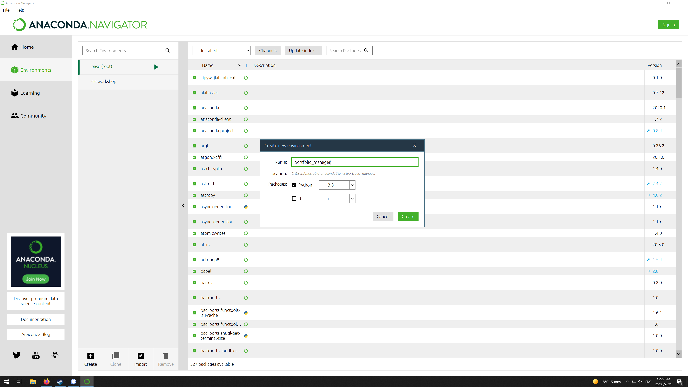
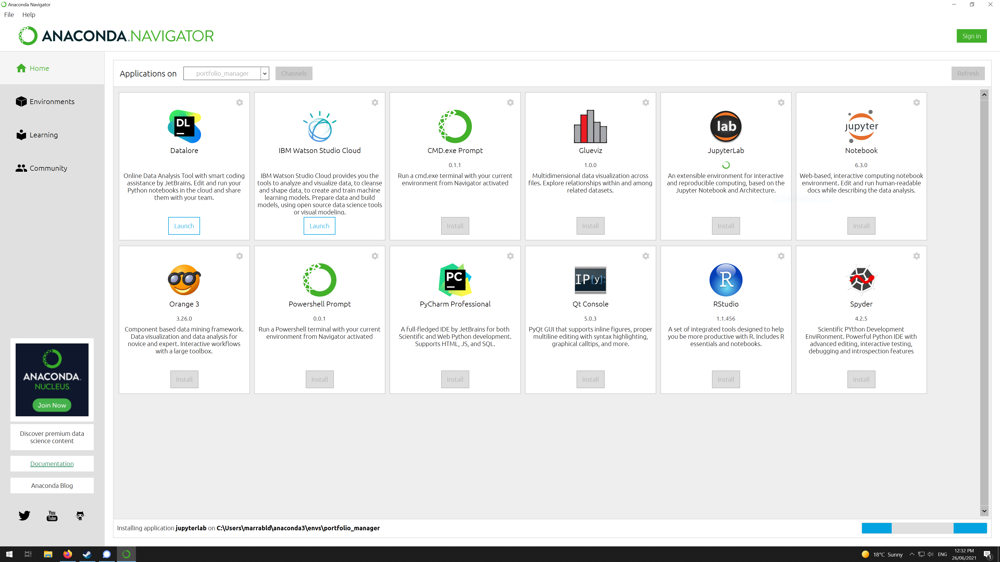
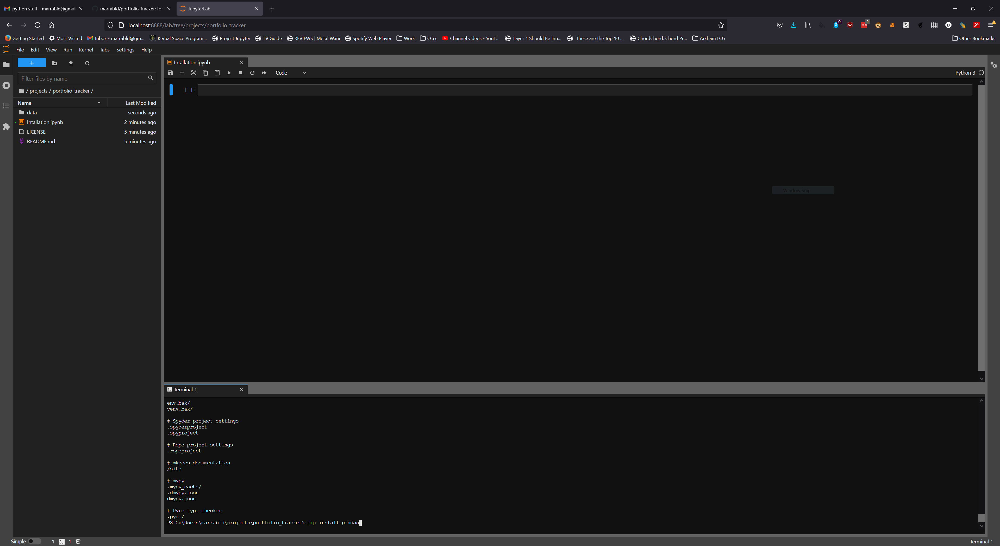
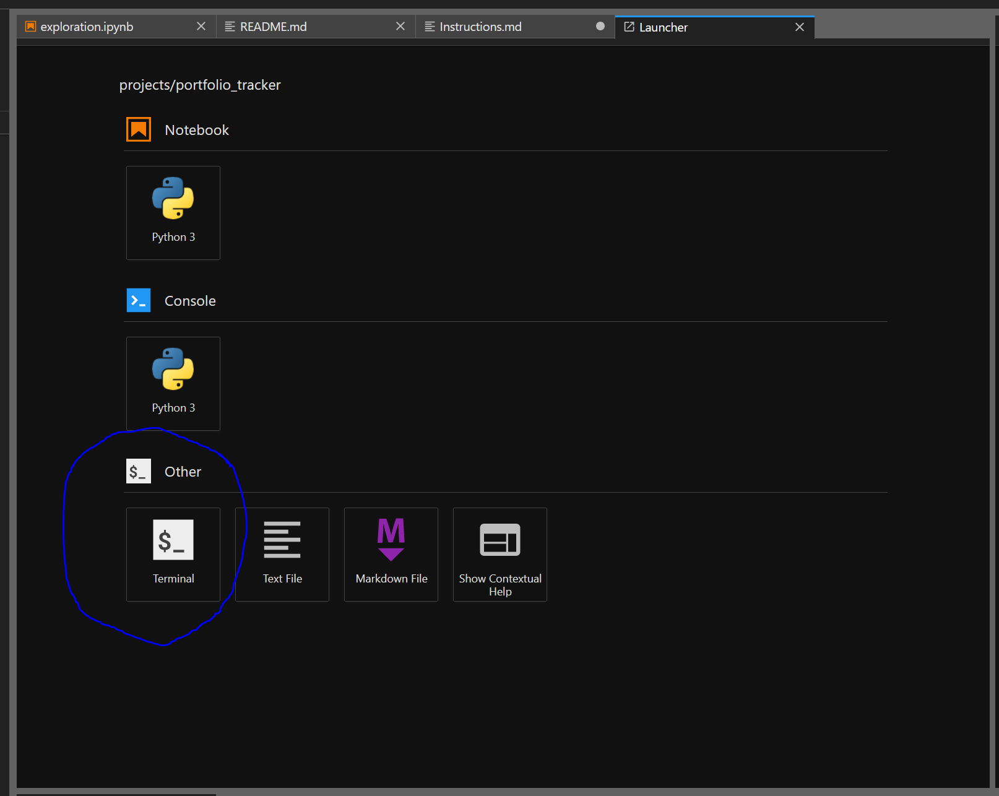
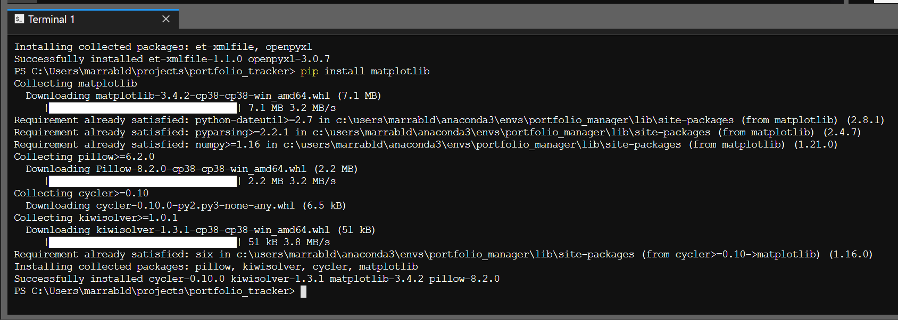
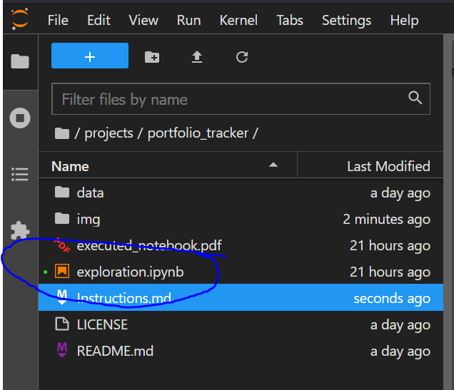
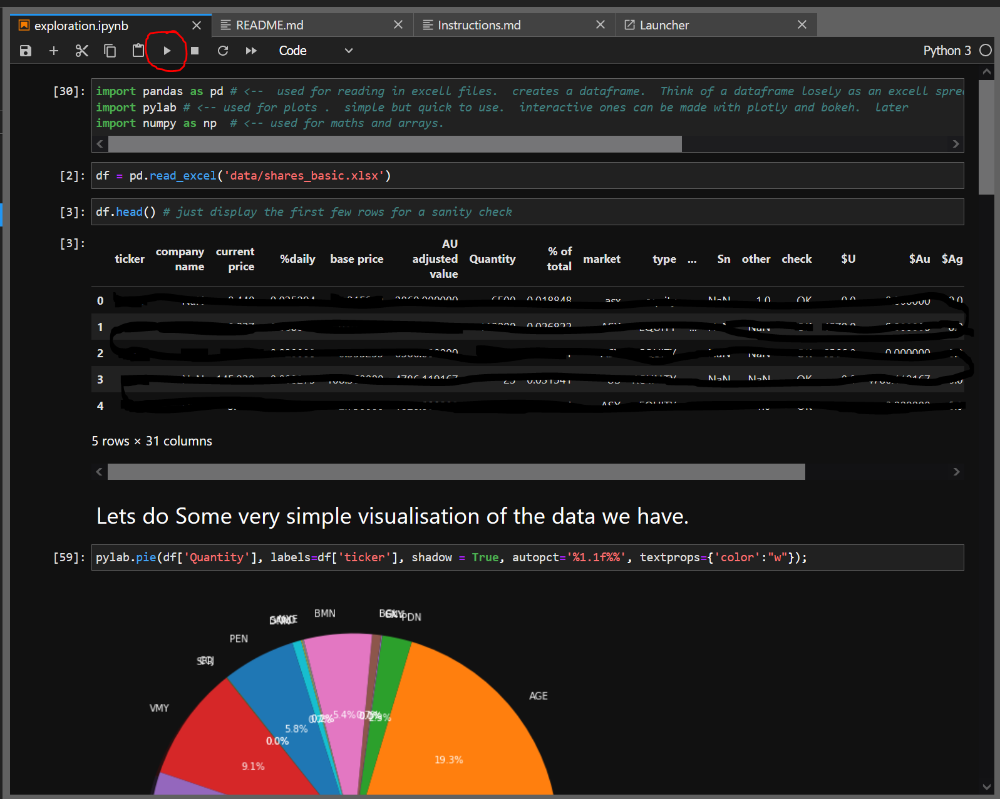

# How to get the notebook up and running in Windows. 

We need to create a new python and notebook environment so that our project dependencies are isolated from other projects.



Create new Environment and give a sensible name `portfolio_manager` for example.



Install JupterLab by clicking the install button.  Then click the launch button.



It should open the above image in a browser.   The browser is where we will write and execute the code.

If you don't have a terminal open, use the launcher to open one.



The terminal is where will install some libraries that we will use. 

Type the following into the terminal

```
pip install pandas
pip install matplotlib 
pip install numpy
pip install openpyxl
```



Double click on exploration.ipynb



You should see the following 



You can run the code in each cell by clicking the play button (red) or pressing `ctl+enter`.  Play around with changing the code in the notebook and excecuting each cell.